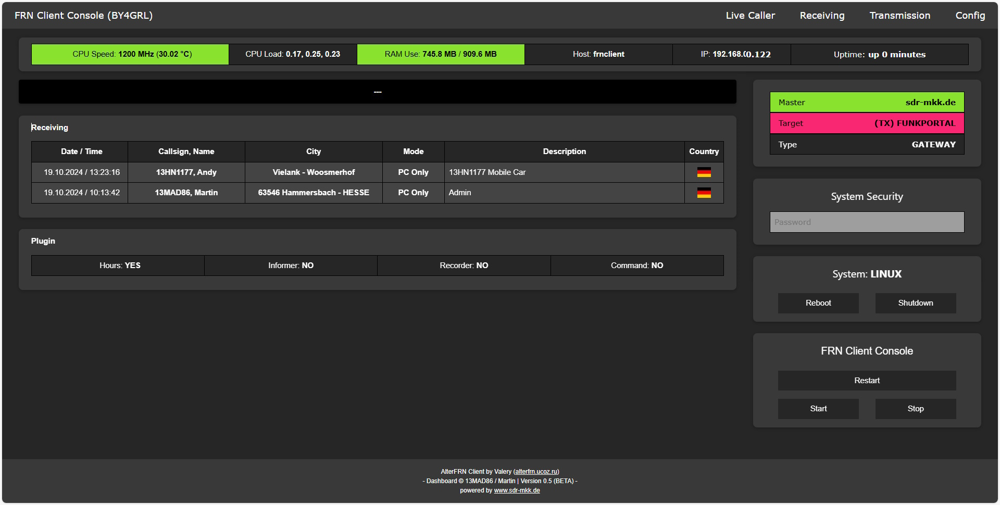

FRN Client Console (AlterFRN) - Dashboard by 13MAD86 / Martin

!!! WARING !!! 
Please use the script at your own risk, do not harm me if any corruption to your system, thanks.

-----

Install copy the files to the home directory on the device e.g:
- /home/pi/

You need to install Python 3 and psutil, do it like:
- sudo apt-get install python3-dev python3-pip
- sudo pip3 install psutil

please note that you need to edit 2 files on your system:
- frndashboard.service @ ExecStart

You need to determint the dashboard to run it at boot of the device.
- ExecStart=/usr/bin/sudo /usr/bin/python3 /home/pi/dashboard.py

Copy the dashboard service to the systemed service folder.
- sudo cp frndashboard.service /etc/systemd/system/frndashboard.service

Enable and start the service with:
- sudo systemctl enable frndashboard.service
- sudo systemctl start frndashboard.service 

The following lines need also to be edited on the dashboard.py to work on your system:

Here you need to define where your config file are locatated:
- config.read(r'/home/pi/frnconsole.cfg')

Here you need to define where the web script files are located:
- WEBPATH = "/home/pi/dashboard"

Same as in config.read, you need to define the config file location:
- CFGFILE = "/home/pi/dashboard/frnconsole.cfg"

And finaly you need to define where the log file is located:
- LOGFILE = "/home/pi/frnclientconsole.log"

-----

ChangeLog:

- Version 0.7: 
Fixed Server Status 
Fixed GW / RX 
Several minor bug fixes

- Version 0.6: 
Added Live Caller 

- Version 0.5: 
Mobile Optimization 
Several minor bug fixes

- Version 0.4: 
Added Transmission entry

- Version 0.3: 
Added Config entry 
Added Navigation

- Version 0.2: 
Several minor bug fixes

- Version 0.1: 
Initial Version
